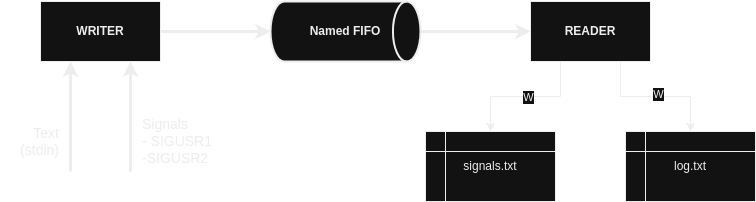
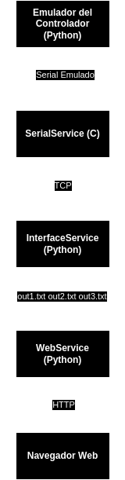

# Sistemas Operativos de Propósito General

## Trabajo práctico 1

### Objetivo
Comunicar dos procesos por medio de un named FIFO. El proceso *writer* podrá recibir texto por
la consola y signals. El proceso *reader* deberá loguear en un archivo el texto que recibe del
proceso *writer* y en otro archivo las signals que recibe el proceso *writer*.

### Arquitectura del sistema



**Proceso writer:**

Este proceso iniciará y se quedará esperando que el usuario ingrese texto hasta que presione ENTER.
En ese momento escribirá en una named FIFO los datos con el siguiente formato: *DATA:XXXXXXXXXXXX*

En cualquier momento el proceso podrá recibir las signals SIGUSR1 y SIGUSR2. En dicho caso deberá
escribir en el named FIFO el siguiente mensaje: *SIGN:1* o *SIGN:2*

**Proceso reader:**

Este proceso leerá los datos del named fifo y según el encabezado "DATA" o "SIGN" escribirá en el archivo *log.txt* o *signals.txt*

### Ejecución

Para iniciar proceso writer (compilación y ejecución):
```sh
make writer
```

Para iniciar proceso reader (compilación y ejecución):
```sh
make reader
```

Para enviar señales SIGUSR al proceso writer:
```sh
kill -SIGUSR1 {writer PID}
kill -SIGUSR2 {writer PID}
```

El PID del writer se ofrece en el mensaje de inicialización del proceso.

## Trabajo práctico 2

### Objetivo
Desarrollar un sistema de domótica para el manejo de 3 luces. El sistema permitirá controlar las
luces (emuladas con LEDs) desde una página web y desde los pulsadores del controlador.

### Arquitectura del sistema



**Emulador:**

Mediante un script de python se simulará un dispositivo de hardware controlador de las 3 luces
y las 3 teclas que encenderán o apagarán dichas luces. Este emulador permite simular el uso del
puerto serie para enviar tramas para controlar el estado de las salidas y recibir tramas cuando
se presionen los pulsadores. En este caso, los pulsadores no existen sino que el mismo emulador permitirá ingresar eventos de pulsado desde la consola utilizando el teclado.

**PC:**

Mediante la PC se alojará un sitio web también provisto, el cual mostrorá una lista de lamparas
y un botón que permitirá seleccionar su estado (encendida o apagada).

El servidor web leerá y escribirá los archivos: **/tmp/out1.txt, /tmp/ou2.txt y /tmp/out3.txt**

- El servidor web lee el contenido de los archivos para mostrar el estado de las lámparas en
la página web.
- El servidor web escribe el contenido de los archivos al presionar el botón para cambiar la
lampara de estado.
- El servicio InterfaceService escribirá en los archivos (en la salida lámpara correspondiente)
cuando reciba por socket una trama de que se presionó un pulsador.
- El servicio InterfaceService leerá los archivos y al detectar un cambio enviará por socket
una trama indicando el nuevo valor de la lámpara.

**Servicio "Serial Service"**

El  emulador se comunicará con el servicio SerialService mediante el puerto serie, que deberá
recibir las tramas indicando que se presionó un pulsador. Cuando esto ocurra, deberá informarlo
al servicio InterfaceService mediante socket TCP.

También deberá enviar por el puerto serie la trama que le indica al emulador si debe encender la
salida 1, salida 2 o salida 3, información que le provee el servicio InterfaceService (cuando
se modifican los archivos desde el sitio web).

Por último este servicio iniciará un servidor TCP para que el servicio InterfaceService se puede
conectar y comunicar.

### Protocolo serie entre el Emulador y SerialService y protocolo TCP entre SerialService e InterfaceService

#### Seteo encendido de salida (hacia el emulador)
">OUT:X,Y\r\n"

Siendo X el número de salida (0, 1 ó 2) e Y el estado (0 ó 1).

Esta trama es la misma que enviará InterfaceService a SerialService.

#### Evento pulsador (desde el emulador)
">SW:X,Y\r\n"

Siendo X el número de salida (0, 1 ó 2) e Y el nuevo estado a setear (0 ó 1).

Esta trama es la misma que enviará SerialService a InterfaceService.
